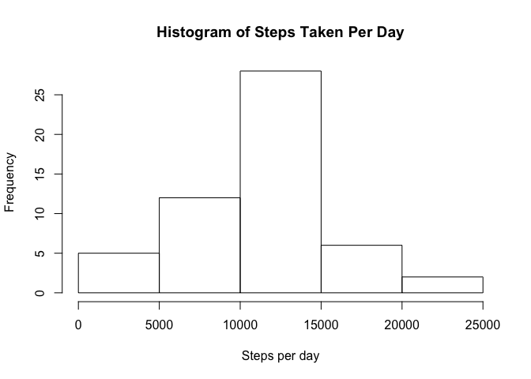
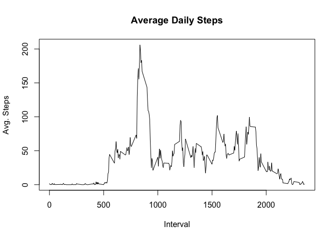
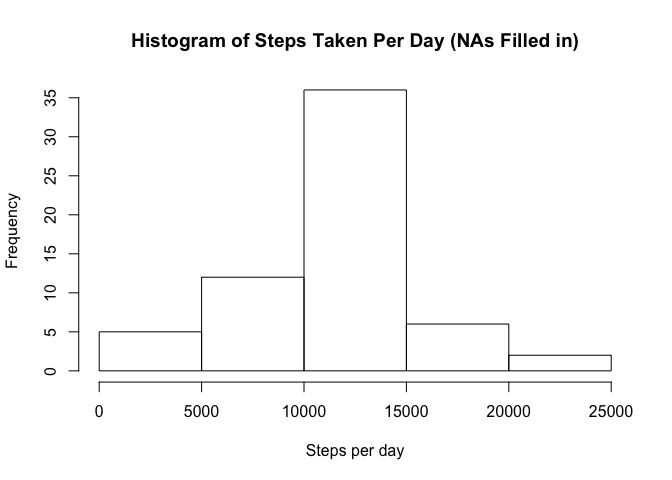
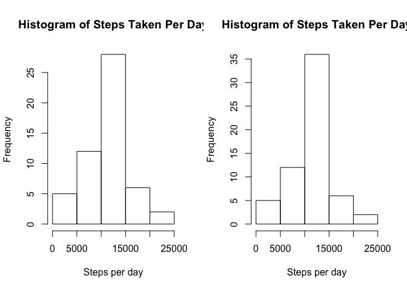
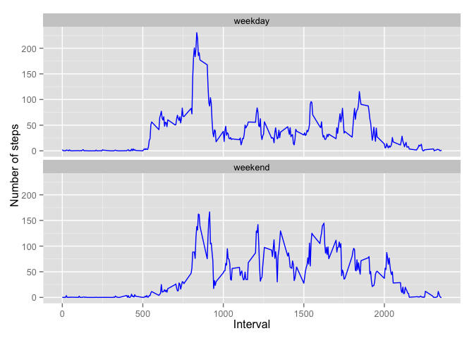

# Reproducible Research: Peer Assessment 1

By default `echo = TRUE`, so don't need to change it here.

## Load and preprocess the data
### Load necessary libraries:

```r
library(ggplot2)
library(dplyr)
```

```
## 
## Attaching package: 'dplyr'
## 
## The following objects are masked from 'package:stats':
## 
##     filter, lag
## 
## The following objects are masked from 'package:base':
## 
##     intersect, setdiff, setequal, union
```

```r
library(knitr)
```

### Load data
After clone the repository, the data file activity.zip should be in the same directory as this RMarkdown script. 
Unzip the file:

```r
unzip(zipfile="./activity.zip")
```

Read in the csv file:

```r
activity <- read.csv("activity.csv", header = TRUE, sep = ',',  colClasses = c("numeric", "character", "integer"))
```

### Process data
Add datetime field to the dataset by combining date and interval

```r
activity <- transform(activity, 
    datetime = strptime(paste(date, formatC(interval, width=4, flag="0")), "%Y-%m-%d %H%M"))
```

## Mean total number of steps taken per day
### Calculate the total number of steps taken per day

```r
stepsPerDay <- aggregate(steps ~ date, data = activity, FUN = sum)
```

### Histogram of the total number of steps taken each day

```r
hist(suppressWarnings(as.integer(unlist(stepsPerDay))), xlab = "Steps per day", ylab = "Frequency", main = "Histogram of Steps Taken Per Day")
```

 

### Calculate and report the mean and median of the total number of steps taken per day
Mean steps taken per day:

```r
meanStepsPerDay <- mean(stepsPerDay$steps, na.rm = TRUE)
meanStepsPerDay
```

```
## [1] 10766.19
```
Median steps taken per day:

```r
medianStepsPerDay <- median(stepsPerDay$steps, na.rm = TRUE)
medianStepsPerDay
```

```
## [1] 10765
```

## Average daily activity pattern
### Average daily steps
Calculate average steps per interval:

```r
stepsPerInterval <- aggregate(steps ~ interval, data = activity, FUN = mean)
```

Plot average steps per interval:

```r
plot(stepsPerInterval$interval, stepsPerInterval$steps, type = "l",
     xlab = "Interval", ylab = "Avg. Steps", main = "Average Daily Steps")
```

 

### 5-minute interval that contains the maximum number of steps
Find out which 5-minute interval, on average across all the days in the dataset, contains the maximum number of steps

```r
stepsPerInterval[which.max(stepsPerInterval$steps), ]
```

```
##     interval    steps
## 104      835 206.1698
```
Interval #835 has the maximum number of steps of about 206. 

## Imputing missing values

### Total number of missing values
Calculate and report the total number of missing values in the dataset (i.e. the total number of rows with NAs)

```r
sum(is.na(activity$steps))
```

```
## [1] 2304
```

### Fill in missing values using the mean for same 5-minute interval
Join the activity data with the stepsPerInterval that was calculated earlier:

```r
filledActivity <- inner_join(activity, stepsPerInterval, by="interval")
```
Create a new dataset that is equal to the original dataset but with the missing data filled in. Fill in missing values with the means for same 5-minute interval, and make the new dataset `filledActivity`

```r
for (i in 1:nrow(filledActivity)) {
    if (is.na(filledActivity$steps.x[i])) {
        filledActivity$steps.x[i] <- filledActivity$steps.y[i]
    }
}
```

### Histogram of the total number of steps taken each day 

```r
stepsPerDayFilled <- aggregate(steps.x ~ date, data = filledActivity, FUN = sum)
hist(suppressWarnings(as.integer(unlist(stepsPerDayFilled))), xlab = "Steps per day", ylab = "Frequency", main = "Histogram of Steps Taken Per Day (NAs Filled in)")
```

 

### Mean and median total number of steps taken per day
Calculate and report the mean and median total number of steps taken per day

```r
meanStepsPerDayFilled <- mean(stepsPerDayFilled$steps.x, na.rm = TRUE)
meanStepsPerDayFilled
```

```
## [1] 10766.19
```
Median steps taken per day:

```r
medianStepsPerDayFilled <- median(stepsPerDayFilled$steps.x, na.rm = TRUE)
medianStepsPerDayFilled
```

```
## [1] 10766.19
```

### Comparison
After filling in missing numbers, the mean steps per day stayed same as 10766.19, but median steps per day has increased from 10765 to 10766.19. 

Values | Original Dataset  | New Dataset (Filled in NAs)
------------- | ------------- | -------------
Mean steps per day  | 10766.19 | 10766.19
Median steps per day  | 10765 | 10766.19

After imputing missing data, the total daily number of steps has increased:


```r
par(mfrow = c(1, 2)) 
hist(suppressWarnings(as.integer(unlist(stepsPerDay))), xlab = "Steps per day", ylab = "Frequency", main = "Histogram of Steps Taken Per Day")
hist(suppressWarnings(as.integer(unlist(stepsPerDayFilled))), xlab = "Steps per day", ylab = "Frequency", main = "Histogram of Steps Taken Per Day")
```

 

## Differences in activity patterns between weekdays and weekends
Add a field `type` to the new dataset indicating if it's a weekend or weekday:

```r
filledActivity <- mutate(filledActivity, type = ifelse(weekdays(filledActivity$datetime) == "Saturday" | weekdays(filledActivity$datetime) == "Sunday", "weekend", "weekday"))
```

Plot the average number of steps per 5-minute interval for weekend vs. weekday:


```r
avgSteps <- aggregate(steps.x ~ interval + type, data = filledActivity, mean)

ggplot(avgSteps, aes(interval, steps.x)) + geom_line(color = 'blue') + facet_wrap(~type, ncol = 1, nrow = 2) +
    xlab("Interval") + ylab("Number of steps")
```

 
